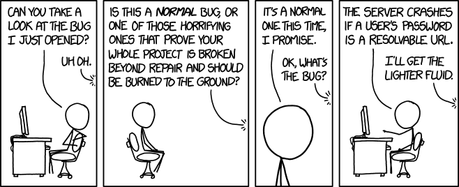

# ([C++](Cpp.md)) [Bug](CppBug.md)

A [bug](CppBug.md) is a [runtime error](CppRuntimeError.md).

Removing [bugs](CppBug.md) is called [debugging](CppDebug.md).

## Different kind of [bugs](CppBug.md)

A bug taxonomy from [The Dodgy Coder](http://www.dodgycoder.net/2011/11/yoda-conditions-pokemon-exception.html):

 * Heisenbug: a [bug](CppBug.md) that disappears or alters its characteristics when an attempt is made to study it
 * Higgs-Bugson: a hypothetical [bug](CppBug.md) predicted to exist based on a small number of possibly related event log entries and vague anecdotal reports from users, but it is difficult (if not impossible) to reproduce on a dev machine because you don't really know if it's there, and if it is there what is causing it. To find these you will need to invest in a Large Hadron debugger
 * Schrödinbug: refers to a function/feature that appears to fluctuate between buggy and correct (like Schrödinger's cat, fluctuating between alive and dead), until somebody looks at the source code (opens the box), at which point it becomes permanently bugged
 * Loch Ness Monster Bug: a [bug](CppBug.md) which cannot be reproduced or has only been sighted by one person
 * UFO bug: a [bug](CppBug.md) presented by customers, who, even when they're shown that it doesn't exist, will repeatedly report it again and again, believing it is real
 * Mandelbug: a [bug](CppBug.md) whose causes are so complex that its behavior appears chaotic or even non-deterministic. Named after fractal innovator Benoît Mandelbrot
 * Brown-paper-bag bug: a [bug](CppBug.md) in a public software release that is so embarrassing that the author notionally wears a brown paper bag over his head for a while
 * Sorcerer's apprentice mode bug: a [bug](CppBug.md) in a protocol where, under some circumstances, the receipt of a message causes multiple messages to be sent, each of which, when received, triggers the same bug
 * Mad girlfriend bug: a [bug](CppBug.md) whose immediate effect remains hidden - the app outwardly seems to function normally and tells you that everything is fine
 * Excalibur bug: when all of the developers within a company have tried to fix a particular [bug](CppBug.md) but none have succeeded, so far
 * Load-bearing [printf](CppStdPrintf.md) bug: when a line of debug output is required for the code to work - the code does not function if you remove it

