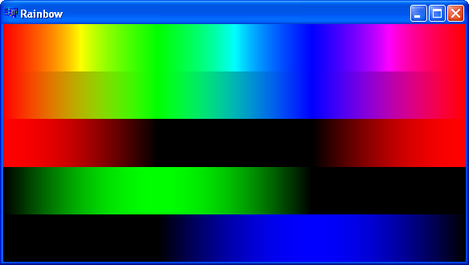

# ([C++](Cpp.md)) [Rainbow](CppRainbow.md)


[Rainbow](CppRainbow.md) is a [graphics](CppGraphics.md)
[class](CppClass.md) to create a rainbow.



Note that this code is completely incorrect:

 * instead of a sine, just use slopes
 * input is checked by asserts, where exceptions should be used

```c++
#include <cassert>
#include <cmath>
#include <algorithm>

void Rainbow(
  const double x, 
  unsigned char& r, 
  unsigned char& g, 
  unsigned char& b)
{
  const int r0 = GetRed(x);
  const int g0 = GetGreen(x);
  const int b0 = GetBlue(x);
  const int max = std::max(r0, std::max(g0,b0));
  assert(max!=0);

  r = 255.0 * static_cast<double>(r0) / static_cast<double>(max);
  g = 255.0 * static_cast<double>(g0) / static_cast<double>(max);
  b = 255.0 * static_cast<double>(b0) / static_cast<double>(max);
}

unsigned char GetRed(const double x)
{
  assert( x >= 0.0 && x < 1.0);
  const double f = std::max(0.0,
    (x < 0.5
    ?  std::cos(x * 1.5 * M_PI)
    : -std::sin(x * 1.5 * M_PI)
    ) );
  assert( f >= 0.0);
  assert( f <= 1.0);
  const double y = 255.0 * f;
  assert( static_cast<int>(y) < 256 );
  return static_cast<unsigned char>(y);
}

unsigned char GetGreen(const double x)
{
  assert( x >= 0.0 && x < 1.0);

  const double f = std::max(0.0, std::sin( x * 1.5 * M_PI ) );
  assert( f >= 0.0);
  assert( f <= 1.0);
  const double y = 255.0 * f;
  assert( static_cast<int>(y) < 256 );
  return static_cast<unsigned char>(y);
}

unsigned char GetBlue(const double x)
{
  assert( x >= 0.0 && x < 1.0);

  const double f = std::max(0.0, -std::cos( x * 1.5 * M_PI ) );

  assert( f >= 0.0);
  assert( f <= 1.0);
  const double y = 255.0 * f;
  assert( static_cast<int>(y) < 256 );
  return static_cast<unsigned char>(y);
}
```